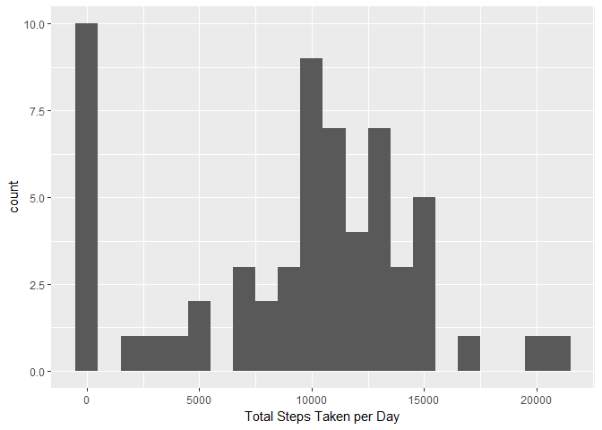
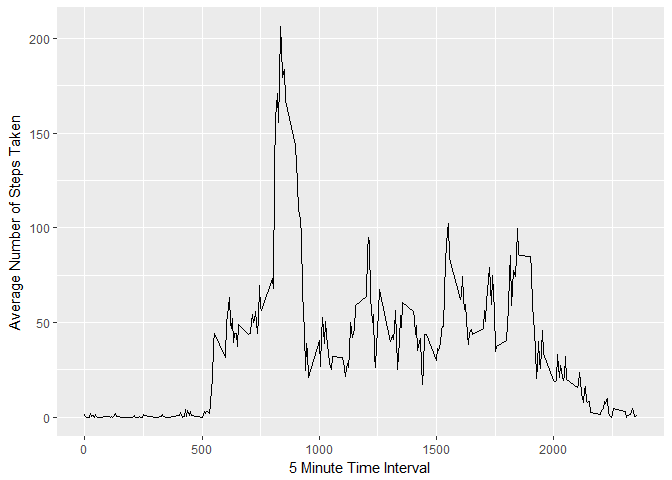
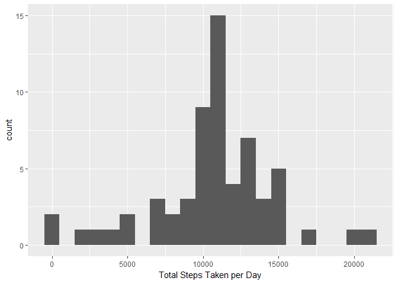
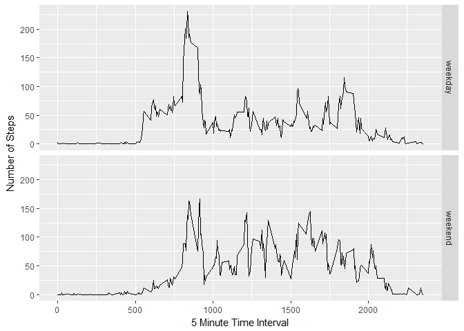

# Reproducible Research: Peer Assessment 1


## Loading and preprocessing the data


## What is mean total number of steps taken per day?

```r
totalSteps <- tapply(data$steps, data$date, FUN = sum, na.rm = TRUE)
qplot(totalSteps, binwidth = 1000, xlab = "Total Steps Taken per Day")
```

<!-- -->

```r
mean(totalSteps)
```

```
## [1] 9354.23
```

```r
median(totalSteps)
```

```
## [1] 10395
```


## What is the average daily activity pattern?

```r
intervalSteps <- aggregate(x=list(steps = data$steps), 
                           by=list(interval = data$interval), FUN = mean,
                           na.rm = TRUE)
ggplot(data = intervalSteps, aes(interval, steps)) + geom_line() + 
  xlab("5 Minute Time Interval") + ylab("Average Number of Steps Taken")
```

<!-- -->

```r
mostSteps <- which.max(intervalSteps$steps)
timeForMostSteps <- gsub("([0-9]{1,2})([0-9]{2})", "\\1:\\2", intervalSteps[mostSteps, 'interval'])
```

Most steps taken at interval: 8:35


## Imputing missing values

```r
missing <- sum(is.na(data$steps))
```

Number of missing values: 2304


```r
fillValue <- function(newSteps, newInterval) {
  filled <- NA
  if (!is.na(newSteps))
    filled <- c(newSteps)
  else
    filled <- (intervalSteps[intervalSteps$interval==newInterval, "steps"])
  return(filled)
}
fillData <- data
fillData$steps <- mapply(fillValue, fillData$steps, fillData$interval)
```


```r
totalNewSteps <- tapply(fillData$steps, fillData$date, FUN = sum)
qplot(totalNewSteps, binwidth = 1000, xlab = "Total Steps Taken per Day")
```

<!-- -->

```r
mean(totalNewSteps)
```

```
## [1] 10766.19
```

```r
median(totalNewSteps)
```

```
## [1] 10766.19
```


## Are there differences in activity patterns between weekdays and weekends?

```r
dayOfWeek <- function(date) {
    day <- weekdays(date)
    if (day %in% c("Monday", "Tuesday", "Wednesday", "Thursday", "Friday"))
        return("weekday")
    else if (day %in% c("Saturday", "Sunday"))
        return("weekend")
    else
        stop("invalid date")
}
fillData$date <- as.Date(fillData$date)
fillData$day <- sapply(fillData$date, FUN = dayOfWeek)
```


```r
averageSteps <- aggregate(steps ~ interval + day, data = fillData, mean)
ggplot(averageSteps, aes(interval, steps)) + geom_line() + facet_grid(day~.) + 
  xlab("5 Minute Time Interval") + ylab("Number of Steps")
```

<!-- -->
